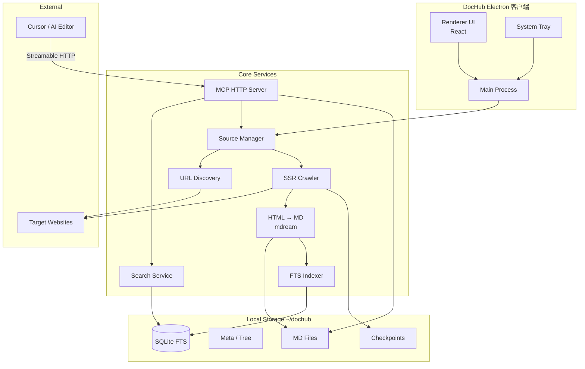
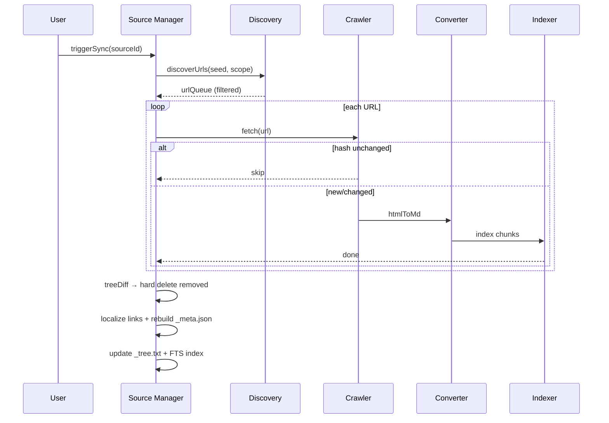
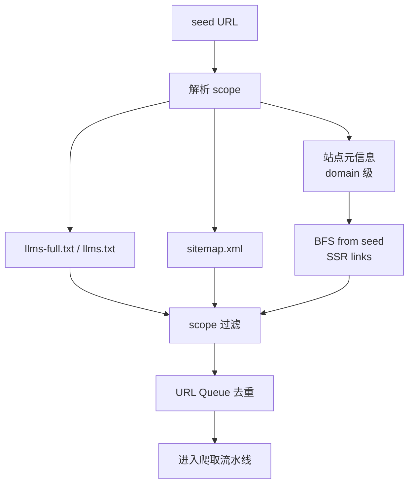
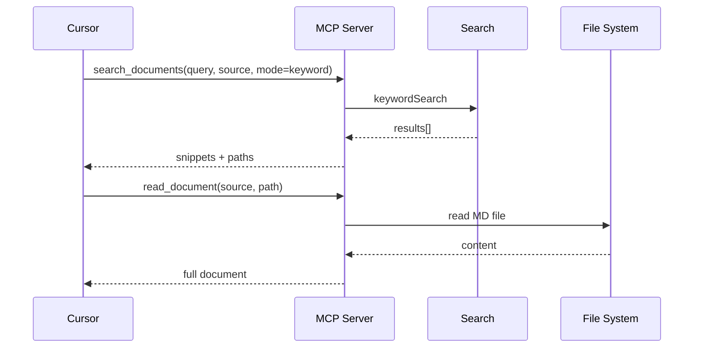

# DocHub 系统架构

## 1. 总体架构



## 2. 进程模型

| 进程             | 职责                             |
| ---------------- | -------------------------------- |
| **Main Process** | 爬取、索引、MCP、配置、托盘、IPC |
| **Renderer**     | UI 展示，通过 IPC 调用 Main      |
| **Preload**      | 安全 IPC 桥接                    |

MCP Server 运行在 Main Process 内，不单独起子进程。

## 3. 模块划分

```
src/
├── main/
│   ├── index.ts              # Electron 入口
│   ├── tray/                 # 系统托盘
│   ├── ipc/                  # IPC handlers（含 MCP 开关/端口）
│   ├── config/               # 配置读写
│   ├── services/             # 业务「后端」：见 project-structure.md
│   │   ├── mcp/
│   │   ├── source/
│   │   ├── discovery/
│   │   ├── crawler/
│   │   ├── converter/
│   │   ├── indexer/
│   │   └── search/
│   └── tray/
├── renderer/                 # React UI
└── shared/                   # 类型、常量、工具
```

## 4. 同步流水线



## 5. URL 发现流程



## 6. MCP 请求流



## 7. 技术选型（v1）

完整选型说明与第三方对比（mdream / Jina Reader / Firecrawl）见 **[tech-stack.md](./tech-stack.md)**。

| 层级             | 选型                                           | 说明                            |
| ---------------- | ---------------------------------------------- | ------------------------------- |
| 桌面框架         | Electron + electron-vite                       | 已有脚手架                      |
| UI               | React                                          | 已有脚手架                      |
| MCP              | 官方 `@modelcontextprotocol/sdk` + Node `http` | Streamable HTTP + `GET /health` |
| 爬取调度         | 自研 Orchestrator                              | 并发、随机延迟、断点、熔断      |
| HTTP             | undici                                         | 爬取请求，支持 customHeaders    |
| HTML 解析        | cheerio                                        | SSR DOM、链接提取               |
| MD 转换          | **@mdream/js**（主） / turndown（fallback）    | LLM 优化输出，MIT               |
| 正文提取（可选） | @mozilla/readability                           | 噪声页面预处理                  |
| 索引             | better-sqlite3 + FTS5                          | 关键词检索                      |
| Sitemap          | sitemap-parser 或参考 mdream                   | XML 解析                        |

爬虫可配置项（并发、随机/固定间隔等）见 **[config.md](./config.md)**。

## 8. v2 预留扩展点

| 扩展点                    | v2 接入                       |
| ------------------------- | ----------------------------- |
| `crawler/spa-fetcher.ts`  | Playwright SPA 渲染与 Page 池 |
| `indexer/vector.ts`       | sqlite-vec + Ollama embed     |
| `search/rerank.ts`        | Ollama bge rerank             |
| `discovery/llm-struct.ts` | LLM 结构化 llms.txt           |
| `source/scheduler.ts`     | 定时同步                      |

## 9. 相关文档

- [v1 PRD](../v1/prd.md)
- [data-model.md](./data-model.md)
- [mcp-tools.md](./mcp-tools.md)
