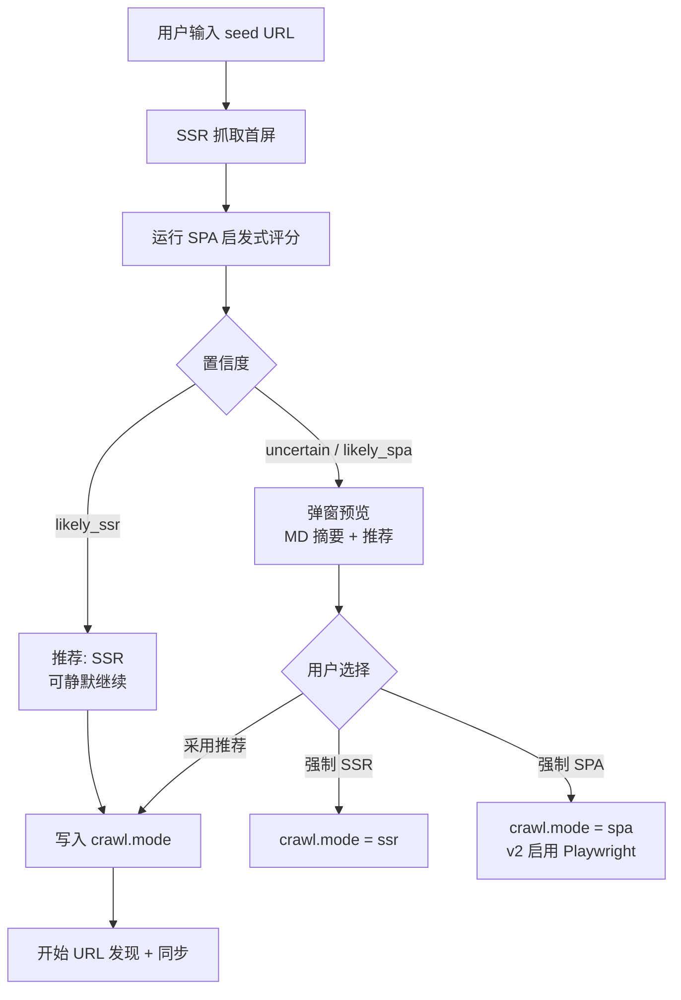

# SPA 页面侦测与确认策略

> 问题：添加文档源时，无法事先知道站点是 SSR 还是 SPA。  
> 结论：**自动侦测 + 首屏预览 + 用户确认（可覆盖）**，不做纯自动、也不做每次都强制手动。

---

## 1. 设计原则

| 原则       | 说明                                                          |
| ---------- | ------------------------------------------------------------- |
| 先快后准   | 首屏只用 **undici SSR 抓取** 做侦测，不默认开 Playwright      |
| 自动为主   | 系统给出 **推荐模式 + 置信度**，减少用户决策负担              |
| 用户可覆盖 | 设置里随时改 `ssr` / `spa` / `auto`                           |
| 按源记忆   | 结论写入 `_source.json`，后续同步不再反复询问（除非用户重测） |

---

## 2. 流程（添加源 / 首次同步前）



**v1（无 Playwright）：**

- 若用户选 **SPA** 或侦测为 **likely_spa**：提示「需 v2 / Playwright，当前将以 SSR 试抓，内容可能不完整」，允许继续或取消
- 首屏 MD 预览帮助用户肉眼判断

**v2（有 Playwright）：**

- 用户选 **SPA** → 全源走 Playwright
- 用户选 **auto** → SSR 优先，单页内容过短且命中 SPA 信号时按页 Playwright fallback

---

## 3. 自动侦测（启发式）

对 seed URL 的 **原始 HTML**（未经 JS 执行）打分，输出：

```typescript
type SpaDetectionResult = {
  confidence: 'likely_ssr' | 'uncertain' | 'likely_spa'
  score: number // 0=SSR, 100=SPA
  signals: SpaSignal[] // 供 UI 展示「为什么这样判断」
  recommendedMode: 'ssr' | 'spa' | 'auto'
  previewMarkdown?: string // 首屏 SSR 转 MD，供用户预览
  previewCharCount: number
}

type SpaSignal = {
  id: string
  weight: number
  hit: boolean
  label: string // 如「正文过少（<500 字符）」
}
```

### 3.1 信号列表（建议）

| 信号 ID                   | 权重 | 判定条件                                                       |
| ------------------------- | ---- | -------------------------------------------------------------- |
| `low_markdown_preview`    | +45  | 首屏 HTML 转 Markdown 后 < **100** 字符（核心 SPA 信号）       |
| `low_body_text`           | +30  | Readability/innerText 有效正文 < 500 字符                      |
| `root_shell`              | +25  | `#app` / `#root` / `#__next` 等容器占主导，子节点极少          |
| `heavy_scripts`           | +15  | `<script src>` 数量 ≥ 5 或 script 总体积占比高                 |
| `framework_marker`        | +20  | 命中 `__NEXT_DATA__`、`__NUXT__`、`vitepress`、`docusaurus` 等 |
| `noscript_warning`        | +10  | 存在「请启用 JavaScript」类 noscript 提示                      |
| `substantial_ssr_content` | -35  | 正文 > 3000 字符且含多个 `<h2>`                                |
| `server_rendered_meta`    | -10  | 存在完整 `<article>` / `<main>` 且段落丰富                     |
| `markdown_content_type`   | -40  | `Content-Type: text/markdown` 或已是 MD                        |

### 3.2 置信度映射

| 综合 score | confidence   | recommendedMode                |
| ---------- | ------------ | ------------------------------ |
| 0–30       | `likely_ssr` | `ssr`                          |
| 31–60      | `uncertain`  | `auto`（v2）/ 提示用户确认     |
| 61–100     | `likely_spa` | `spa`（v2）/ v1 警告后继续 SSR |

阈值可在 `config.json` 的顶层 `spaDetection` 中微调。

---

## 4. 用户确认 UI

### 4.1 何时弹窗

| 场景         | 行为                                            |
| ------------ | ----------------------------------------------- |
| `likely_ssr` | **不弹窗**，Toast「检测为静态页面」；设置页可改 |
| `uncertain`  | **弹窗**，展示预览 + 三选一                     |
| `likely_spa` | **弹窗**，默认高亮「SPA / Playwright」          |

全局选项 `spaDetection.alwaysConfirm`（默认 `false`）：为 true 时即使 `likely_ssr` 也弹窗。

### 4.2 弹窗内容

```
┌─────────────────────────────────────────────┐
│  检测页面类型：electron-vite.org/guide/      │
│  置信度：不确定 (score 45)                   │
│  ■ 正文较少，存在 #app 根节点，脚本较多       │
├─────────────────────────────────────────────┤
│  [首屏 Markdown 预览（渲染后），可滚动]      │
├─────────────────────────────────────────────┤
│  ○ 自动（推荐）  ○ 静态 SSR  ○ SPA 渲染     │
│  [ 采用推荐并开始同步 ]  [ 仅保存，稍后同步 ] │
└─────────────────────────────────────────────┘
```

### 4.3 用户选项与 `crawl.mode`

| 用户选择     | `crawl.mode` | v1 行为                               | v2 行为                            |
| ------------ | ------------ | ------------------------------------- | ---------------------------------- |
| 自动（推荐） | `auto`       | SSR；uncertain/spa 时标记 `needs_spa` | SSR 优先，按页 Playwright fallback |
| 静态 SSR     | `ssr`        | 始终 undici                           | 始终 undici                        |
| SPA 渲染     | `spa`        | SSR 试抓 + 警告                       | 始终 Playwright                    |

设置页提供 **「重新检测」** 按钮，重新跑首屏侦测。

---

## 5. `auto` 模式运行策略（v2）

源级 `crawl.mode = auto` 时：

1. **默认**用 SSR 抓 URL
2. 若单页转换后 MD 过短（如 < 200 字符）且 HTML 有 SPA 信号 → **该 URL 自动改用 Playwright 重抓一次**
3. 重抓仍失败 → 标记 `fetch_failed`，计入重试/熔断

避免全站 Playwright 拖慢静态页。

---

## 6. 配置项

见 [config.md](./config.md) 中 `spaDetection` 与 `spaRender`。

---

## 7. 为什么不二选一

| 方案             | 问题                                                  |
| ---------------- | ----------------------------------------------------- |
| **纯自动**       | 启发式会误判（SSR 带壳、部分 hydration）；用户无感知  |
| **纯手动**       | 每个源都要懂 SSR/SPA，体验差                          |
| **混合（采用）** | 自动给推荐 + 不确定时让人看一眼预览，一次确认长期有效 |

---

## 8. 相关文档

- [v1 PRD](../v1/prd.md) §3.1.4
- [data-model.md](./data-model.md) — `spaDetection` 字段
- [v2/prd.md](../v2/prd.md) — Playwright 联动
