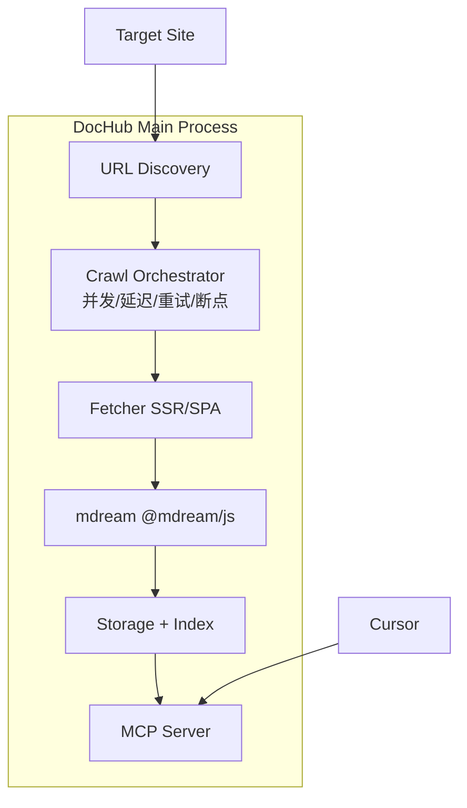

# DocHub 技术选型

> 原则：**本地优先、免费可用、无云端 API 依赖、无额外配额限制**  
> 最后更新：2026-06-26

---

## 1. 选型总览

| 层级 | 选型 | 版本阶段 | 理由 |
|------|------|----------|------|
| 桌面壳 | **Electron** + electron-vite | v1 | 已有脚手架；Main Process 跑爬虫/MCP |
| UI | **React** + TypeScript | v1 | 已有脚手架 |
| MCP | **Hono** + `@modelcontextprotocol/hono` | v1 | `/mcp` + `GET /health`，同端口 8276 |
| MCP 运行时 | `@hono/node-server` | v1 | Main Process 内 `serve({ hostname, port })` |
| HTTP 客户端 | **undici** | v1 | Node 内置友好，性能好 |
| HTML 解析 | **cheerio** | v1 | SSR DOM 解析、链接提取 |
| HTML → MD | **mdream**（`@mdream/js` 或 `mdream` NAPI） | v1 | MIT、LLM 优化输出、比 Turndown 更省 token |
| 备选 HTML → MD | turndown + GFM plugin | — | mdream 不可用时 fallback |
| SSR 爬取 | 自研 Fetcher + cheerio | v1 | 完全可控的配置/断点/熔断 |
| SPA 爬取 | **Playwright** | v2 | 与 mdream crawl 同路线，Electron 可打包 Chromium |
| URL 发现 | 自研 + llms.txt / sitemap / BFS | v1 | 贴合 path scope 模型 |
| 正文提取（备选） | @mozilla/readability | v1 可选 | 噪声页面可叠加 Readability 再送 mdream |
| 关键词索引 | **better-sqlite3** + FTS5 | v1 | 嵌入式，零依赖 |
| 向量索引 | **sqlite-vec** | v2 | 纯本地，无需 Docker |
| AI 推理 | **Ollama**（可选） | v2 | 本地 embed / LLM / rerank，用户自托管 |
| 配置 | JSON + 源级覆盖 | v1 | 简单、可手工编辑 |

---

## 2. 第三方方案对比分析

用户关注的三个开源项目，以及 DocHub 是否适合作为核心依赖。

### 2.1 [mdream](https://github.com/harlan-zw/mdream) — ⭐ 推荐采用（部分）

| 维度 | 评估 |
|------|------|
| **License** | MIT，可商用、无 copyleft |
| **费用** | 完全免费，无 API 配额 |
| **技术栈** | TypeScript / Rust NAPI，与 Electron 同生态 |
| **能力** | HTML→MD（核心）、`@mdream/crawl` 整站爬取、Playwright SPA、llms.txt 生成、语义 chunk |
| **Stars** | 活跃维护，v1 已发布 |

**优势：**

- 输出针对 LLM 优化，token 比 Turndown 少 up to 2x
- `@mdream/crawl` 已覆盖：sitemap/robots、glob 路径过滤、http/playwright 双 driver、crawlDelay
- 与 DocHub 产品方向高度重合（本地 llms.txt + MD 镜像）

**劣势 / 注意：**

- `mdream` 主包含 Rust NAPI，Electron 打包需 `serverExternalPackages` 或优先用 **`@mdream/js`**（纯 JS，无 native 绑定）
- `@mdream/crawl` 的并发默认较高（HTTP driver 最多 20 并发），DocHub 需**自管调度层**覆盖配置
- 不包含：断点续爬、域名熔断、path_prefix scope（seed URL 级）、MCP、FTS/向量索引

**DocHub 采用方式（建议）：**

```
自研 Crawl Orchestrator（配置/断点/熔断/scope）
        ↓
Fetch HTML（undici / Playwright）
        ↓
mdream htmlToMarkdown（@mdream/js，preset minimal）
        ↓
DocHub 存储 + FTS +（v2）向量索引
```

**可参考但不直接依赖：** `@mdream/crawl` 的 sitemap 发现、robots crawl-delay、glob 过滤逻辑。

---

### 2.2 [Jina Reader](https://github.com/jina-ai/reader) — ⚠️ 不推荐作为核心

| 维度 | 评估 |
|------|------|
| **License** | Apache-2.0（OSS 分支） |
| **云端 API** | `r.jina.ai` 免费但有 **[rate limit](https://jina.ai/reader#pricing)**，匿名流量限制更严 |
| **自托管** | `ghcr.io/jina-ai/reader:oss`，含 Chrome + LibreOffice，镜像较重 |
| **能力** | 单页 URL→MD、SPA（Puppeteer）、PDF/Office、丰富 request headers |

**优势：**

- 单页提取质量高，header 控制细（`x-engine`、`x-wait-for-selector` 等）
- OSS 可 Docker 自托管，无 Jina 云端配额

**劣势（不符合 DocHub 原则）：**

- **云端依赖**：若调用 `r.jina.ai`，有配额与限流，数据出本机
- **自托管成本高**：Docker 镜像 bundle Chrome + LibreOffice，不适合嵌入 Electron
- **架构不匹配**：Reader 是「URL in → MD out」无状态服务，不是「本地知识库 + 增量同步 + MCP」
- 整站爬取需自行编排，Reader 不提供 crawl checkpoint

**结论：** 可作为**参考实现**（HTML 提取策略、SPA wait 逻辑），**不集成**为运行时依赖。DocHub 坚持本地自研抓取 + mdream 转换。

---

### 2.3 [Firecrawl](https://github.com/firecrawl/firecrawl) — ❌ 不推荐

| 维度 | 评估 |
|------|------|
| **License** | 主代码 **AGPL-3.0**；SDK 部分 MIT |
| **云端** | `firecrawl.dev` 需 API Key，按 **credits** 计费 |
| **自托管** | 支持，但栈复杂（多服务），AGPL 对桌面闭源分发有义务 |
| **Stars** | 139k+，能力全面：scrape / crawl / map / agent |

**优势：**

- 业界最强的「网页→LLM 数据」pipeline 之一
- Crawl / Map / Batch 成熟，官方 MCP Server

**劣势（不符合 DocHub 原则）：**

- **云端必收费/限额**：Quick Start 即要求 API Key，credits 制
- **AGPL copyleft**：Electron 应用若链接/修改 AGPL 代码分发，需开源衍生作品（法律层面需评估，风险高于 MIT/Apache）
- **过度集成**：Agent、Search 等与 DocHub「本地镜像知识库」定位无关
- 自托管运维成本远高于 Playwright + mdream 组合

**结论：** 学习其 API 设计（scrape options、crawl job 模型）即可，**不引入**代码或云服务依赖。

---

### 2.4 对比矩阵

| 项目 | 本地免费 | 无配额 | License 友好 | Electron 嵌入 | 整站爬取 | 与 DocHub 契合 |
|------|----------|--------|--------------|---------------|----------|----------------|
| **mdream** | ✅ | ✅ | MIT ✅ | ✅（@mdream/js） | ✅（@mdream/crawl） | ⭐⭐⭐⭐⭐ |
| **Jina Reader** | ⚠️ 自托管可以 | ❌ 云端有限 | Apache ✅ | ❌ Docker 重 | ❌ 需自研 | ⭐⭐ |
| **Firecrawl** | ⚠️ 自托管可以 | ❌ 云端 credits | AGPL ⚠️ | ❌ | ✅ | ⭐ |

---

## 3. DocHub 最终技术栈（按模块）

### 3.1 爬取层

| 组件 | 选型 | 说明 |
|------|------|------|
| 调度器 | **自研** | 并发、随机延迟、重试、熔断、checkpoint |
| SSR Fetch | **undici** | 支持 customHeaders |
| SPA Render | **Playwright** | v2；复用 Electron 或独立 Chromium |
| robots.txt | **robots-parser** 或自研 | 可配置开关 |
| sitemap | **sitemap-parser** 或参考 mdream | 域名级发现 |
| llms.txt | 自研解析 | 失败跳过；v2 LLM 结构化 |

### 3.2 转换层

| 组件 | 选型 | 说明 |
|------|------|------|
| 主转换 | **@mdream/js** + `preset/minimal` | LLM 友好、纯 JS |
| Fallback | **turndown** + gfm | mdream 失败时 |
| 噪声页面 | **@mozilla/readability** → mdream | 可选预处理 |

### 3.3 索引与搜索

| 组件 | 选型 | 阶段 |
|------|------|------|
| 关键词 | SQLite FTS5 | v1 |
| 向量 | sqlite-vec + Ollama embed | v2 |
| Rerank | Ollama（用户指定 bge 等） | v2 |

### 3.4 客户端与 HTTP 服务

| 组件 | 选型 |
|------|------|
| 桌面 | Electron + React |
| HTTP 框架 | **Hono** + `@hono/node-server` |
| MCP | `/mcp` — Streamable HTTP |
| REST | `/health` — 健康检查（见 [http-api.md](./http-api.md)） |
| 托盘 | Electron `Tray`（三平台） |

---

## 4. 依赖清单（npm）

### v1 生产依赖（建议）

```json
{
  "@mdream/js": "latest",
  "@hono/node-server": "latest",
  "@modelcontextprotocol/server": "latest",
  "@modelcontextprotocol/hono": "latest",
  "better-sqlite3": "latest",
  "cheerio": "latest",
  "hono": "latest",
  "undici": "latest",
  "zod": "latest"
}
```

### v2 追加

```json
{
  "playwright": "latest",
  "sqlite-vec": "latest"
}
```

### 明确不引入

- `firecrawl` / `firecrawl-py` — AGPL + 云端 credits
- 调用 `r.jina.ai` — 云端限流
- `crawl4ai` — Python 栈，不适合 Electron 主进程
- `@mdream/crawl` 作为黑盒 — 可借鉴，DocHub 自研调度以支持断点/熔断/scope

---

## 5. 架构示意（含 mdream）



---

## 6. 风险与缓解

| 风险 | 缓解 |
|------|------|
| mdream NAPI 在 Electron 打包失败 | 默认 `@mdream/js` 纯 JS 引擎 |
| Playwright 体积大 | 用户已接受；可选首次使用时下载 browser |
| mdream 版本 beta | pin 版本；turndown fallback |
| 站点反爬 | 随机延迟、customHeaders、降并发；不依赖第三方 proxy 服务 |

---

## 7. 相关文档

- [config.md](./config.md) — 爬虫可配置项
- [architecture.md](./architecture.md)
- [v1 PRD](../v1/prd.md)
