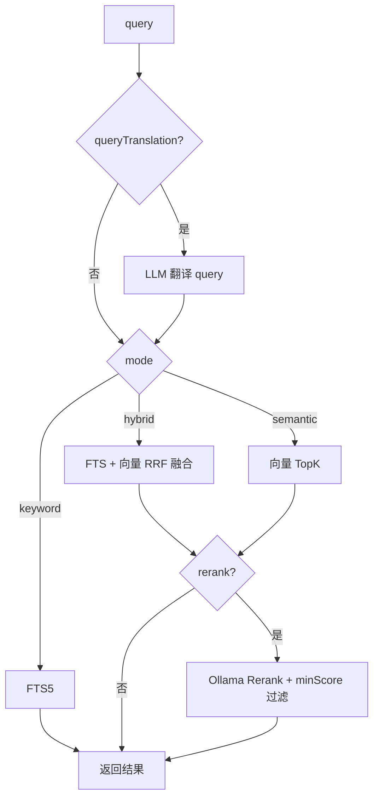

# DocHub v2 产品需求文档（PRD）

> 版本：v2.0-draft  
> 状态：已定稿  
> 依赖：v1 全部能力  
> 范围：Ollama 增强、SPA 爬取、定时同步、语义检索与 Rerank

---

## 1. v2 目标

在 v1 本地知识库基础上，增加：

1. **Playwright SPA 爬取** — 支持 JS 渲染文档站
2. **Ollama 可选接入** — 嵌入模型 + 小模型 LLM
3. **语义 / 混合检索** — 向量 + FTS 融合
4. **Rerank** — 用户指定 Ollama 本地 rerank 模型（默认推荐 bge）
5. **LLM 增强 URL 发现** — 结构化非标准 llms.txt
6. **定时同步** — 灵活调度 + hash 增量
7. **跨语言检索增强** — 多语 embed + 可选查询翻译

---

## 2. 用户故事（v2 新增）

### US-07 SPA 文档站同步

**作为**开发者，**我希望** DocHub 能识别并正确处理 JS 渲染的文档站，**以便**覆盖 VitePress SPA 等站点。

**验收标准：**

- [ ] 添加源时 SSR 抓首屏 + 启发式 SPA 侦测（见 [spa-detection.md](../shared/spa-detection.md)）
- [ ] `uncertain` / `likely_spa` 时弹窗预览 MD，用户确认 `auto` | `ssr` | `spa`
- [ ] `crawl.mode=spa` 或 `auto`（v2）使用 Playwright
- [ ] `auto` 模式：SSR 优先，单页 MD 过短则 Playwright fallback
- [ ] 设置页「重新检测」与模式切换

### US-08 语义搜索

**作为**开发者，**我希望**配置 Ollama 后用自然语言搜索文档，**以便**不必精确关键词。

**验收标准：**

- [ ] 配置嵌入模型后，`search_documents` 支持 `semantic` / `hybrid`
- [ ] 未配置 Ollama 时行为与 v1 一致（仅 keyword）
- [ ] 向量索引在同步后自动更新
- [ ] 推荐多语 embed 模型（见 §4.3）

### US-09 Rerank 精排

**作为**开发者，**我希望**检索结果经 Rerank 重排并过滤低分内容，**以便** AI 拿到更相关片段。

**验收标准：**

- [ ] Rerank 可选开启，模型由用户在 Ollama 中指定
- [ ] 默认推荐 `bge-reranker-v2-m3`
- [ ] `rerank.minScore` 默认 0.6，范围 0–1
- [ ] 低于阈值的 chunk 不返回

### US-10 LLM 结构化 llms.txt

**作为**开发者，**我希望** llms.txt 格式不完整时 DocHub 仍尽可能提取 URL，**以便**加快发现速度。

**验收标准：**

- [ ] Ollama 小模型启用时，对无法机器解析的 llms.txt 做结构化
- [ ] 输出 `{ url, title?, section? }[]`，经 scope 过滤后入队
- [ ] 未启用 Ollama → 与 v1 一致，跳过

### US-11 定时同步

**作为**开发者，**我希望**按 schedule 自动增量同步，**以便**文档保持较新。

**验收标准：**

- [ ] 默认关闭
- [ ] 支持 interval + unit（hour / day / week / month）
- [ ] 基于 content hash 增量，不重复下载未变页面
- [ ] 定时任务可 UI 查看下次执行时间

### US-12 跨语言检索

**作为**开发者，**我希望**用中文提问也能搜到英文文档，**以便**降低语言障碍。

**验收标准：**

- [ ] 默认推荐多语 embed 模型
- [ ] 单语模型时在 UI 提示跨语言能力受限
- [ ] 可选开启「查询翻译增强」：检索前用小模型将 query 译为文档语言

---

## 3. 功能需求

### 3.1 Ollama 集成

```json
{
  "ollama": {
    "enabled": true,
    "baseUrl": "http://127.0.0.1:11434",
    "embeddingModel": "nomic-embed-text",
    "llmModel": "qwen2.5:3b",
    "queryTranslation": {
      "enabled": false
    },
    "rerank": {
      "enabled": false,
      "model": "bge-reranker-v2-m3",
      "minScore": 0.6,
      "topK": 20
    }
  }
}
```

| 能力 | API | 用途 |
|------|-----|------|
| 嵌入 | `POST /api/embed` | chunk 向量化、语义检索 |
| 小模型 | `POST /api/chat` | llms.txt 结构化、查询翻译 |
| Rerank | Ollama 加载 rerank 模型 | 对候选 chunk 重打分 |

**参考实现：** [autodev-codebase](https://github.com/anrgct/autodev-codebase) Ollama embed + rerank 模式。

### 3.2 向量索引

- 存储：`~/dochub/.index/vectors.db`（sqlite-vec）
- 与 FTS 共用 chunk 切分规则（`chunk.maxChars`）
- 同步后异步 embed 新/变更 chunk
- embed 失败不阻塞文件存储，标记 `index_pending`

### 3.3 检索流程



**Hybrid 融合建议：** Reciprocal Rank Fusion (RRF)，不依赖分数归一化。

### 3.4 SPA 爬取

| 模式 | 行为 |
|------|------|
| `ssr` | 始终 undici + cheerio |
| `spa` | 始终 Playwright |
| `auto` | SSR 优先；单页 MD < `autoRetryMinMdChars` 且具 SPA 信号 → Playwright 重抓 |

Playwright 配置：

- 复用单 Browser 实例，按 concurrency 开 page
- 等待 `networkidle` 或文档站常见 selector（可配置 timeout）
- 渲染后 DOM → 同一套 mdream 流水线

侦测与用户确认流程见 [spa-detection.md](../shared/spa-detection.md)（v1 首屏侦测，v2 启用 Playwright）。

### 3.5 LLM 结构化 llms.txt

**触发条件：** `parseOk === false` 且 `ollama.enabled && llmModel`

**Prompt 目标：** 从 raw text 提取 JSON 数组：

```json
[
  { "url": "https://example.com/docs/a", "title": "A", "section": "Guide" }
]
```

**后处理：** scope 过滤 → 去重 → 合并到 URL queue

### 3.6 定时同步

```json
{
  "schedule": {
    "enabled": false,
    "interval": 1,
    "unit": "day"
  }
}
```

| unit | 说明 |
|------|------|
| `hour` | 每 N 小时 |
| `day` | 每 N 天 |
| `week` | 每 N 周 |
| `month` | 每 N 月（按 30 天计） |

- 应用托盘常驻时由 Main Process scheduler 触发
- 同一源不并发同步（排队）

### 3.7 MCP 变更（v2）

`search_documents` 扩展：

| 参数 | v2 新增/变更 |
|------|-------------|
| `mode` | 支持 `semantic`、`hybrid` |
| `rerank` | 可选 boolean，默认跟随全局配置 |
| `minScore` | 可选，覆盖 rerank 阈值 |

可选新增 `get_ollama_status`：Ollama 连通性、已配置模型。

---

## 4. 跨语言检索说明

### 4.1 问题

- 英文文档 + 中文 query：单语 embed / FTS 效果差
- 多语 embed 可缓解，但不保证与同源同语言同等精度

### 4.2 产品策略

| 场景 | 行为 |
|------|------|
| 无 Ollama | 仅 keyword，**不支持跨语言** |
| Ollama + 多语 embed | 跨语言**尽力支持** |
| Ollama + 单语 embed | UI 警告，建议更换模型 |
| queryTranslation 开启 | 检索前翻译 query，提高跨语言召回 |

### 4.3 推荐模型

| 用途 | 模型 | 说明 |
|------|------|------|
| 嵌入 | `nomic-embed-text` | 多语，Ollama 常用 |
| 嵌入 | `bge-m3` | 多语 |
| Rerank | `bge-reranker-v2-m3` | 多语 rerank，用户自行 pull |
| 小模型 | `qwen2.5:3b` | llms 结构化 / 查询翻译 |

---

## 5. 非功能需求（v2 增量）

| 类别 | 要求 |
|------|------|
| 性能 | 语义搜索 < 2s（含 Ollama embed query） |
| 资源 | Playwright 内存可控；embed 队列可配置并发 |
| 降级 | Ollama 不可达 → 自动降级 keyword，UI 提示 |

---

## 6. v2 不包含

- 站点专用适配器插件（v3）
- 导出 / 备份（v3）
- MCP 写操作（同步触发等）

---

## 7. 相关文档

- [v1 PRD](../v1/prd.md)
- [shared 公共文档](../shared/)
- [todo.md](./todo.md)
- [v3 PRD](../v3/prd.md)
